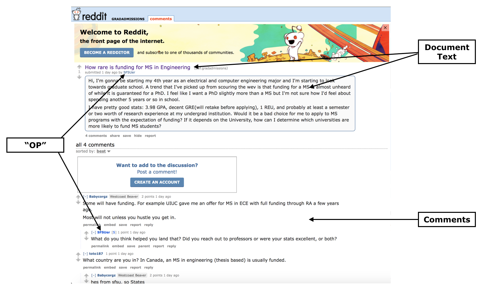

The internet can be a pretty [toxic, nasty place](https://www.vice.com/en_us/article/8xxymb/here-are-reddits-whiniest-most-low-key-toxic-subreddit) (*Warning: NSFW language), especially when like-minded toxic, nasty people get together to share their toxic, nasty thoughts. Of course, seeking out virtual interaction with like-minded people is [sometimes good](https://arstechnica.com/information-technology/2017/05/these-are-the-online-communities-we-will-never-forget/). And sometimes the much-maligned "front page of the internet" can [be good and do good](https://gizmodo.com/reddit-is-helping-some-people-deal-with-their-mental-he-1825364592).

These were some of the thoughts I had as I was planning out my fourth project at Metis, which emphasized Natural Language Processing (NLP) and unsupervised learning. Going through the vast data and resources from the [Stanford Network Analysis Project (SNAP)](https://snap.stanford.edu/data/index.html), I came across [a study](https://snap.stanford.edu/data/web-RedditPizzaRequests.html) about [free pizza requests](https://snap.stanford.edu/data/web-RedditPizzaRequests.html) made on [r/Random_Acts_of_Pizza](https://www.reddit.com/r/Random_Acts_Of_Pizza/), a subreddit where users make such requests of other users. Some of these are successful while some are not, and with results of each request documented, the group conducting the study was able to build a classificaiton model to shed light on features leading to success of actually receiving a free pizza from another user.

I decided to attempt a similar project using a different, advice-driven subreddit -- [r/gradamissions](https://www.reddit.com/r/gradadmissions/), a subreddit for graduate school candidates to obtain information and share experiences about the application process. My main objectives for this project were:

* To understand which topics best describe user-submitted questions to this subreddit using Topic Modeling, and
* To explain how these topics (and characteristics of the submitted questions) contribute to incidence of “useful feedback” using a Logistic Regression model.

Here, "useful feedback" can be any collection of responses to a submitted question where other users sufficiently address the concerns of the original poster (OP). This may be indicated by the OP simply thanking or otherwise expressing gratitude to other users for their responses. Ultimately, the goal of this effort would be to help r/gradadmissions users in structuring their questions to receive the best possible feedback and encourage future visits and contributions to discussions.

## The Data

Let's take a look at an example r/gradadmissions user-submitted question and its associated responses.

