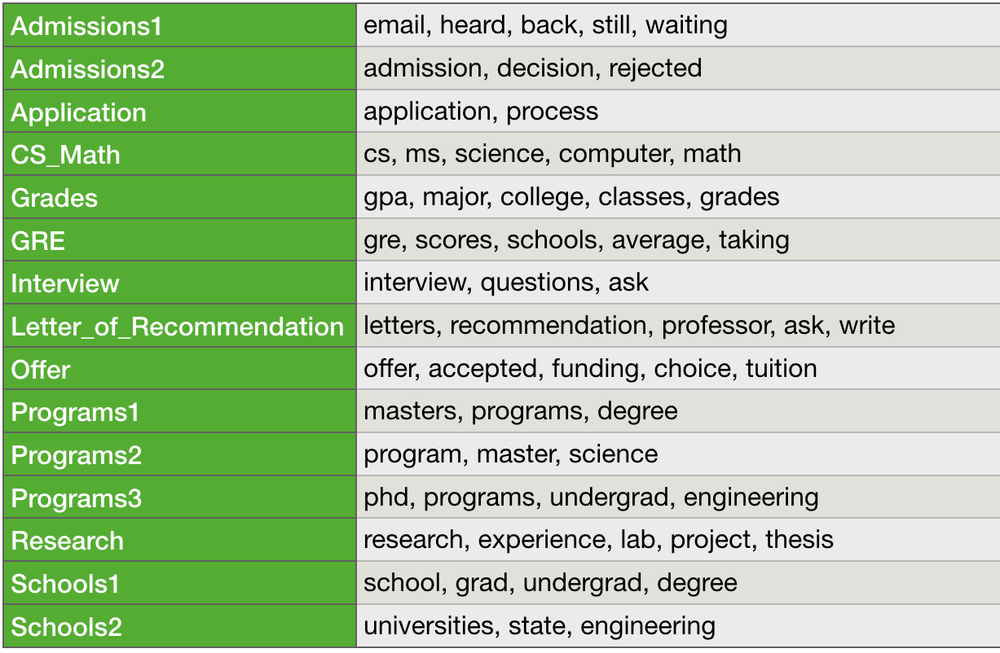
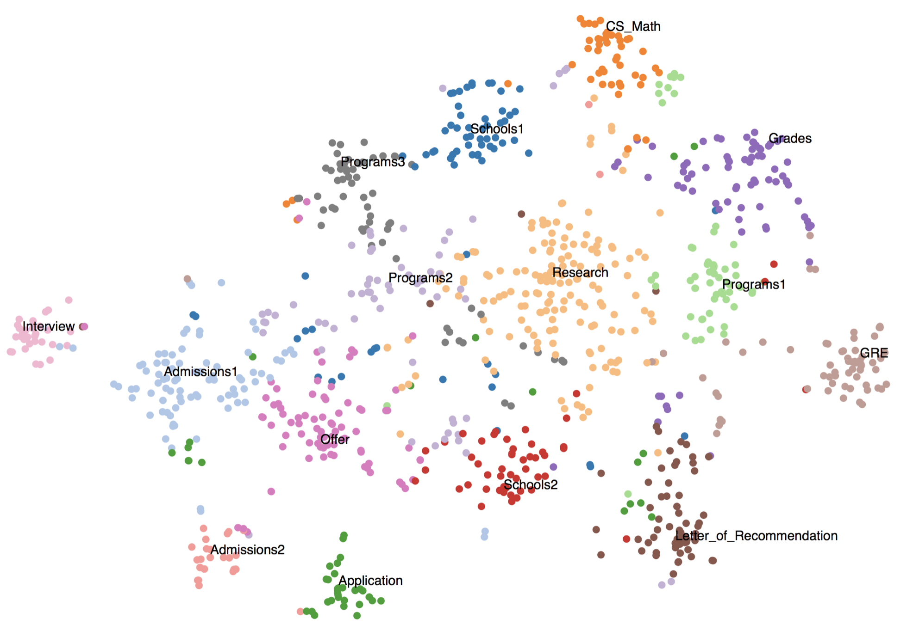
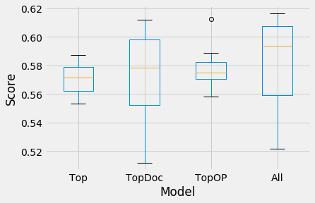
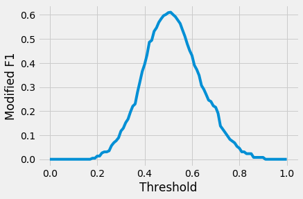
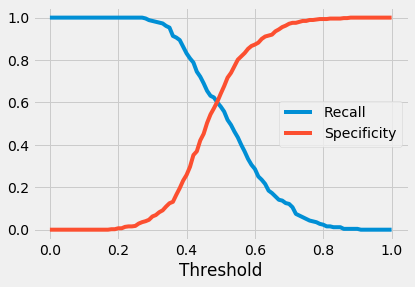
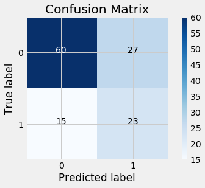
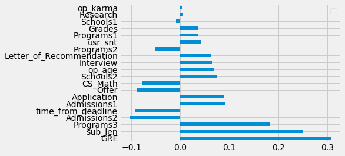

The internet can be a pretty [toxic, nasty place](https://www.vice.com/en_us/article/8xxymb/here-are-reddits-whiniest-most-low-key-toxic-subreddit) (*Warning: NSFW language*), especially when like-minded toxic, nasty people get together to share their toxic, nasty thoughts. Of course, seeking out virtual interaction with like-minded people is [sometimes good](https://arstechnica.com/information-technology/2017/05/these-are-the-online-communities-we-will-never-forget/). And sometimes the much-maligned "front page of the internet" can [be good and do good](https://gizmodo.com/reddit-is-helping-some-people-deal-with-their-mental-he-1825364592).

These were some of the thoughts I had as I was planning out my fourth project at Metis, which emphasized Natural Language Processing (NLP) and unsupervised learning. Going through the vast data and resources from the [Stanford Network Analysis Project (SNAP)](https://snap.stanford.edu/data/index.html), I came across [a study](https://snap.stanford.edu/data/web-RedditPizzaRequests.html) about [free pizza requests](https://snap.stanford.edu/data/web-RedditPizzaRequests.html) made on [r/Random_Acts_of_Pizza](https://www.reddit.com/r/Random_Acts_Of_Pizza/), a subreddit where users make such requests of other users. Some of these are successful while some are not, and with results of each request documented, the group conducting the study was able to build a classificaiton model to shed light on features leading to success of actually receiving a free pizza from another user.

I decided to attempt a similar project using a different, advice-driven subreddit that happens to be close to my heart (or the darkness of it, amirite) -- [r/gradamissions](https://www.reddit.com/r/gradadmissions/), a subreddit for graduate school candidates to obtain information and share experiences about the application process. My main objectives for this project were:

* To understand which topics best describe user-submitted questions to this subreddit using Topic Modeling, and
* To explain how these topics (and characteristics of the submitted questions) contribute to incidence of “useful feedback” using a Logistic Regression model.

Here, "useful feedback" can be any collection of comments responding to a submitted question where other users sufficiently address the concerns of the original poster (OP). This may be indicated by the OP simply thanking or otherwise expressing gratitude to other users for their responses. Ultimately, the goal of this effort would be to help r/gradadmissions users in structuring their questions to receive the best possible feedback and encourage future visits and contributions to discussions.

## The Data

A document for my corpus is a given user-submitted question to r/gradadmissions and any supporting text entered by the OP. Let's take a look at an example document below:

<p align="center">
  
</p>

Here, we have a question from a reddit user named SFSUer (the OP), who is kind of an overachiever and wants to know about receiving funding for a Master's degree in Engineering. From the above, you can see that I'm treating as a document the combination of the question in the title of the submission and the body of text in the box below. In the comments in response to this question, our OP has returned to follow up but hasn't exactly thanked any other commenter at this point, so I would label this document as one where "useful feedback" has not been received.

I collected ~1000 documents like the above using [PRAW](https://praw.readthedocs.io/en/latest/), the **P**ython **R**eddit **A**PI **W**rapper, scraping user-submitted questions (or submission in PRAW parlance) and associated comments into separate data structures linked by a common submission ID. The collected documents cover a period from March 7, 2018 through May 30, 2018. For each submssion, we can also use PRAW to pull any needed information about each OP that we need as well.

Before performing any analysis, it should be noted that not every collected document is actually a question. Taking the path of least resistance, I filtered out submissions that were not explicitly questions using punctuation -- essentially looking for the presence of question marks in each document text. I also removed questions which had only been posted within 24 hours of collection, eventually leaving me with 829 documents (and their ~6000 associated comments) to analyze.

## Topic Modeling: What are grad school candidates even asking?

With my complete corpus now set, I first transformed the collected documents (the user-submitted questions to r/gradadmissions) into vectors of weighted tokens (in this case word tokens) -- that is, I mapped each document to all words in the corpus according to some metric capturing the frequency for each given word in the document -- what's referred to as a [Bag-of-Words model](https://en.wikipedia.org/wiki/Bag-of-words_model). The metric used here is *term frequency-inverse document frequency*, or *tf-idf*, which measures the tradeoff between the frequency of occurrence of a given word in a document against its frequency of occurrence across the entire corpus. From this construction, tf-idf measures the [importance](https://www.kdnuggets.com/2018/08/wtf-tf-idf.html) of a given word to a particular document.

Using scikit-learn's `TfidfVectorizer`, one can transform a set of text documents into a *document-term matrix*, where each row is a vector of weighted tokens (words) corresponding to an individual document (question). `TfidfVectorizer` may be tuned according to the following parameters to modify the document-term matrix output:

* `token_pattern`: denoting what text constitues a word (a string of at least two consecutive alphanumeric characters)
* `stop_words`: specifying a list of words to ignore -- usually commonly occurring words that provide little to no information about a document (such as most pronouns)
* `ngram_range`: defining the minimum and maximum length of a sequence of words to evaluate (for this case only single words, and not multi-word phrases)
* `min_df`, `max_df`: specifying the minimum and maximum document frequencies for a given word to be included in the matrix -- especially rare or common words are thus ignored as uninformative.

I tuned the last three sets of the above parameters in tandem with using [Non-Negative Matrix Factorization](http://scikit-learn.org/stable/modules/generated/sklearn.decomposition.NMF.html) (NMF) to extract a specified number of topics from the documents. NMF allows us to derive these topics from the document-term matrix, decomposing it into a pair of non-negative matrices, the document-topic and topic-term matrix. The former of these assigns a vector of weights to each document basically reflecting the intensity of the topic in the document, while the latter assigns a vector of weights to each topic basically reflecting the intensity of the association of a given word to the topic. Consequently, for some chosen number of topics, one may obtain the top words for each topic -- for example:

```
Topic #0: gpa, major, semester, ve, grades, years, classes, overall, undergrad, low
Topic #1: school, accepted, hear, applied, faculty, worth, schools, haven, little, state
Topic #2: program, master, field, phd program, psychology, email, applied, post, accepted, research
Topic #3: research, experience, lab, research experience, good, really, summer, doing, project, related
Topic #4: just, really, want, like, feel, don, ve, lot, good, people
Topic #5: phd, ms, thesis, phd program, phd programs, experience, want, ve, apply, undergrad
Topic #6: university, state, list, universities, applying, programs, ms, strong, currently, different
Topic #7: cs, math, classes, major, courses, semester, ms, degree, level, really
Topic #8: year, semester, time, summer, got, applying, grades, applications, did, apply
Topic #9: grad, grad school, undergrad, want, getting, don, school, advice, think, ll
Topic #10: programs, applying, ve, getting, phd programs, looking, interested, sure, apply, fall
Topic #11: time, job, work, need, field, going, doing, ve, working, does
Topic #12: work, years, like, know, college, working, great, students, help, good
Topic #13: think, professor, don, got, did, letter, know, good, recommendation, professors
Topic #14: schools, gre, good, apply, scores, know, field, looking, student, experience
Topic #15: offer, interview, accepted, decision, funding, email, received, tuition, choice, got
Topic #16: graduate, graduate school, undergrad, admissions, undergraduate, classes, department, background, student, degree
Topic #17: application, college, admissions, background, undergraduate, just, applied, letters, ask, process
Topic #18: masters, degree, years, applied, looking, experience, applying, accepted, help, working
Topic #19: science, courses, engineering, course, computer, computer science, want, fall, master, summer
```

From above there is at least one topic (Topic #4) with a whole lot of nothing and at least two other topics (Topics #2 and #5, for instance) that seem redundant -- which might lead one to continue playing around with different lists of `stop_words`, values for `min_df` and `max_df`, different ranges for `ngram_range`, and of course, different numbers of topics in an effort to get topics which are clearer and more specific. (Note: This process can be extremely time and sanity-consuming, and worst of all, a little bit too manual.)

Ultimately, I was able to obtain a relatively resolved set of topics by considering only unigrams (single words) and without having to aggressively tune `stop_words` and `min_df` and `max_df` too much. Below are the 15 topics I ultimately settled upon, along with the top words associated with each topic which helped with naming each topic:

<p align="center">
  
</p>

You can observe that there are some redundant topics -- attempts to reduce the number of topics (to say, 10-12 topics) tended to result in these same redundancies appearing while losing other topics entirely. For the most part, nothing particularly distinguished these cases from each other, except for the two Admissions topics. The topic "Admissions1" might emphasize pending admissions decisions more, while "Admissions2" seemed to focus more on decisions already processed.

## Visualizing the Topics

As previously mentioned, the document-topic matrix output by NMF represents each document as a weighted vector of the topics essentially describing how much content a given document contains for each topic. I chose to assign each document to a topic according to the topic with maximum weight for the document. Doing so gets us part of the way towards observing the distribution of topics across the documents and the relationships amongst the documents.

In order to really explore the documents and the topic distribution visually, we need to be able to take the 15-dimension representation from the document-topic matrix to two dimensions. Out of many such [dimensionality reduction techniques](https://www.analyticsvidhya.com/blog/2018/08/dimensionality-reduction-techniques-python/), I chose t-Distributed Stochastic Neighbor Embedding (t-SNE) to represent my topic model. t-SNE is a method especially [suited for high-dimensional data visualization](https://lvdmaaten.github.io/tsne/) which effectively captures the similarity between given points in its initial higher-dimensional space and then attempts to maintain the similarity in lower dimensions.

I adapted some code from a [tutorial](https://shuaiw.github.io/2016/12/22/topic-modeling-and-tsne-visualzation.html) for creating a t-SNE visualization of a topic model in [Bokeh](https://bokeh.pydata.org/en/latest/) to create the below visual representation of my documents and topics.

<p align="center">
  
</p>

We can see that documents with similar maximally-weighted topic matter tended to be to close to one another as a result of the t-SNE output. Topics pertaining to the admissions process before applications are sent out (GRE, Grades, Letter of Recommendation) clustered together, with the same being true for topics focused on the post-application submission process (Interview, Offer, the two Admissions topics). I wasn't quite sure what to make of the centrality of the Research topic, but on the other hand it is a rather critical element to the decision to attend grad school.

## OK, but what about "Useful Feedback": From Unsupervised Learning to a Logistic Regression model

Now, recall that one of the objectives here was to see if the topic matter of submitted questions to r/gradadmissons impacted the incidence of "useful feedback" from the subreddit's users. I intended to use a Logistic Regression model because this problem has a binary target and I was interested in interpretability (what topics and other document characteristics are predictive of "useful feedback") as much as I was in predicting specific types of feedback.

For each document (a submitted question), I checked to see if the OP had first contributed to the comments, and then had made some expression of gratitude -- what amounts to the somewhat naive search for the word "thanks" (or some of its variations: e.g., "thank you", "tysm", etc.) in the OP's follow-up comments. If both of these conditions were satisfied, then the question had elicited "useful feedback" (positive class), otherwise the question did not (negative class). Defining the classes as such resulted in ~35% of documents labeled as eliciting "useful feedback" so I needed to set the parameter `class_weight = balanced` to address class imbalance for all models.

Having thus defined the target of the Logistic Regression models, I then specified the following features:

* Topic features, from the document-topic matrix,
* Document features, characteristics of the submitted questions themselves: the length of the question, the time the question was posted relative to the [April 15th deadline](https://cgsnet.org/april-15-resolution) for admissions decisions, and the sentiment associated with the question using the [compound score](https://stackoverflow.com/questions/40325980/how-is-the-vader-compound-polarity-score-calculated-in-python-nltk) from [VADER](https://github.com/cjhutto/vaderSentiment), and
* OP features, characteristics of the submitting user him/herself: "age" (how long the user has been on Reddit) and [karma score](https://www.reddit.com/r/firstdayontheinternet/comments/30b44n/could_someone_explain_how_the_reddit_karma_system/).

I evaluated four candidate Logistic Regression models, using all scikit-learn default parameters except for `class_weight`:

* **Top**, using only Topic features,
* **TopDoc**, using Topic and Document features,
* **TopOP**, using Topic and OP features, and
* **All**, using all features.

After using `StandardScaler` to standardize all features for all models (as by default, scikit-learn Logistic Regression has built-in regularization), I set aside the most recent 15% of the data as a holdout set while training over the remaining. I split this data further into a series of training and validation sets, starting from the earliest 65% of this set through the earliest 85% in single-percentage point increments -- so 21 splits in all. Each model was evaluated over these splits using a modification of the [F1 score](https://en.wikipedia.org/wiki/F1_score), replacing Precision with *Specificity* (or the True Negative Rate) as a metric to be balanced against Recall. I used this metric because I wanted to prioritize the correct identification of questions which actually elicited "useful feedback" as well as those not actually eliciting such feedback in order to provide a more complete picture of the potential feedback a prospective r/gradamissions user might encounter. Also, like [Precision and Recall](http://scikit-learn.org/stable/auto_examples/model_selection/plot_precision_recall.html), the metrics Recall and Specificity have [competing objectives](http://med.emory.edu/EMAC/curriculum/diagnosis/sensand.htm).

<p align="center">
  
</p>

From the above, I chose the all features Logistic Regression model **All**, as it resulted the highest average value for my modification of the F1 score. Certainly the variance of this model's performance across all validation sets is larger than would be preferred, but lower variance models (the topics-only model **Top** and the topics and OP model **TopOP** are not as good on average, and **All** outperforms both across the majority of validation sets).

I attempted to improve the performance of the **All** model by tuning the decision threshold for classifying observations into the positive class on the full training set. Changing the threshold from the default (probability of being in the positive class) of 0.5 doesn't turn out to improve performance much:

<p align="center">
  
</p>

An increase of this threshold to 0.51 slightly improved model performance, ultimately prioritizing the correct identification of questions not eliciting "useful feedback" (Specificity) just a bit over doing the same for questions eliciting "useful feedback" (Recall):

<p align="center">
  
</p>

Evaluating the final version of this model on the holdout set showed the same tradeoff, with better performance in correctly classifying questions that did not elicit "useful feedback" (true negatives):

<p align="center">
  
</p>

Taking a look below at the coefficient values of all features revealed some insight into what characteristics of submitted questions tend to and not to lead to "useful feedback," in terms of topic matter and how questions are presented:

* Focused questions about topics such as the GRE or Interview will increase the (log) odds of receiving the right type of feedback, but more general questions about the types of Programs or Schools to apply also work,
* Some focused questions, such as topics specifically about CS/Math programs, do not work and appear to lead to less "useful feedback," and
* As for presentation of question, longer and more detailed appears to be better, as does posting before the April 15th deadline.

<p align="center">
  
</p>

## Takeaways and other Navel-Gazing

I was pretty satisfied (as much as that is possible for me) with how this project shaped up, both when I originally presented the results at Metis as well as after I took some additional time post-bootcamp to polish some of the work. Of course, that doesn't mean there aren't a number of things that couldn't vastly improve the work here. There should be a better way to characterize "useful feedback" than simply looking for the word "thanks" or some variation of it, since it's completely possible commenters provided zero help while the OP decided to be polite. The same goes for how I decided [what was and was not a question](https://stackoverflow.com/questions/17879551/nltk-find-if-a-sentence-is-in-a-questioning-form), as a given submission may be inquisitive in nature without even using a question mark, especially in relatively informal online communities. I also could have chosen to evaluate the different candidate models differently and perhaps created a different metric that would prioritize how well the model identified true positives and negatives.

One of the bigger shortcomings here, however, was how limited the data was -- how about a full admissions cycle instead of a roughly 3-month period corresponding to when the bulk of admissions decisions are made? Having this kind of data would allow for better interpretation of how questions submitted to r/gradmissions evolved over time. I made a time-lapse version of the earlier t-SNE topic representation below, and, well, I'm not sure I can tell that there is anything interesting in the topics of questions for March through May 2018. I would expect that, over a full admissions cycle, we'd see more questions related to the application process (GRE, Grades) from August up through March of the cycle and then more questions related to admisssions decisions afterwards.

<center>
<iframe src="https://giphy.com/embed/OkiIeoPoPrSSiI1sXK" width="600" height="470" frameBorder="0" class="giphy-embed" allowFullScreen></iframe><p><a href="https://giphy.com/gifs/OkiIeoPoPrSSiI1sXK">via GIPHY</a></p>
</center>

Also, in the [lmgtfy](https://lmgtfy.com) universe of online communities, not fully considering the temporal nature of these data introduces another shortcoming -- was a particular question or something like it posted before? An ongoing (but possibly never to see the light of day) future project for me will be creating something of a web application which will allow a prospective graduate student to input a question and return most similar past submitted questions to r/gradadmissions as well as [similar](https://www.reddit.com/r/GradSchool/) [forums](https://forum.thegradcafe.com) [and](https://www.reddit.com/r/AskAcademia/) [communities](https://www.reddit.com/r/GREhelp/).

To conclude, I'll say that the ultimate results produced by my final model didn't prove to be that unexpected or even that interesting (in fact, an interviewer told me as much when I described this project to him but since he advanced me a round, I'll refrain from roasting him too much). I will say that of course producing some mindblowing insight was not the purpose of this project and that confirming expectations regarding the nature of questions which might elicit the right type of feedback is actually sort of interesting. Having once (actually twice) been a prospective graduate student, I don't think I would have dismissed advice to ask people whether my GRE score or grades were good enough or to ask questions in obnoxious detail about my chances of admission to a probably too long list of potential graduate school programs. It would have been a lot better than applying sort of blindly or the early days of [CollegeConfidential](https://talk.collegeconfidential.com) and its [problematic](https://medium.com/@shawjj/5-reasons-why-college-confidential-is-slowly-killing-you-dd8c68850ddb) [ways](https://www.urbandictionary.com/define.php?term=College%20Confidential). Let's hope r/gradamdissions doesn't become that.
