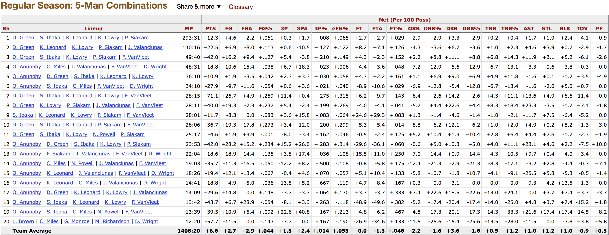
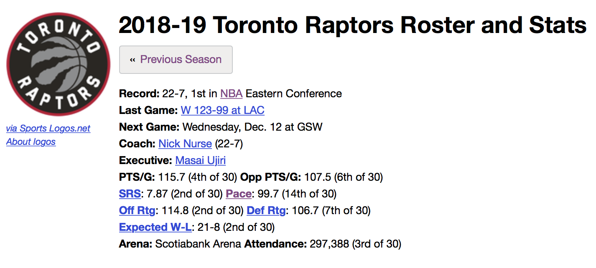
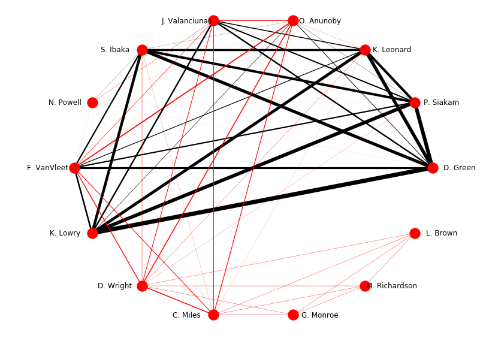

Previously, I [wrote](https://douglaswlee.github.io/NBA-Performance/) a little about a preliminary study to understand what contributes to underperformance and overperformance by NBA teams in terms of the difference between their expected (Pythagorean) winning percentage and their actual winning percentage. One thing that I believed severely limited my efforts (among others) was the absence of [lineup-level data](https://www.basketball-reference.com/teams/TOR/2019/lineups/) (see below) to potentially characterize potential inefficiencies in allocation of minutes on the court between different players.

  

Say for example, the 4th lineup -- the most frequently-played negative lineup by PTS (net points per 100 possessions) for this year's current best team, the [Toronto Raptors](https://www.theringer.com/nba/2018/12/6/18128576/raptors-sixers-elite-east) -- played together over more minutes (MP). That *might* be something that hinders an otherwise high-performing team from winning as much as it should.

Ultimately, I didn't explore (yet) anything related to these kinds of potential playing time/net scoring inefficiencies and their connection to team under/overperformance. But I did want to go deeper than just the five-man lineups to understand how pairs of players impact team performance while on court together as a starting point.

For a given team during a given season, I used BeautifulSoup to scrape a table of five-man lineups as above to estimate (crudely) the *Net Points Contributed* by a given pair of players across all such lineups included in the table. To do so,for  each time a unique pair of players appeared in a given row, I made sure to increment the total minutes played (MP) and net points per 100 possesions (PTS) contributed by the pair. After collecting this data, I constructed a network graph to visualize each player pair's performance, doing the following: 

  

1. Scraped the "front matter" of the page for the team (see above) to collect the team's pace for the season (number of possessions played per 48 minutes)
2. Using the team's pace and lineup-level data, calculated the estimated *Net Points Contributed* for each pair of players which appeared at least once in one of the table of five-man lineups. This estimate is essentially a product of the given team's pace (converted to possessions per minute), each player pair's total minutes played and the total net points (converted to per possession).
3. Created an undirected network graph using [NetworkX](https://networkx.github.io) from the player pair *Net Points Contributed*, where:
* Each node corresponds to each individual player on the team
* Each edge reflects that a pair of players were on the court together during the season. The weight of each edge corresponds to the pair's *Net Points Contributed*. The color indicates if this quantity for the pair are negative (red) or positive (black)

Since I've used the current season's Toronto Raptors as an example throughout, let's take a look at the *Net Points Contributed* of all their player pairs:

  

We see there are quite a few very thick black edges indicating extremely net positive contributions to the Raptors' performance whenever some of their more frequently used players -- for example, Kawhi Leonard ('K. Leonard'), Kyle Lowry ('K. Lowry'), and Pascal Siakam ('P. Siakam') -- play together. However, for a team that has the best record in the NBA (as of this writing) and which is not significantly overperforming (22-7 actual record vs. 21-8 Pythagorean record), there are more prominent red edges than we'd expect. Additionally, many of these edges connect players who, while not the most frequently-used players on Toronto, are certainly no bit players -- such as OG Anunoby ('O. Anunoby') and C.J. Miles ('C. Miles'). Just [last season](https://www.theringer.com/nba-playoffs/2018/4/14/17238988/raptors-wizards-game-1), Toronto won the most games in the Eastern Conference off the strength of its depth and bench players, but so far this season they have had the same amount of success while their [reserves have been less effective](https://www.thestar.com/sports/raptors/2018/12/11/raptors-bench-mob-20-remains-a-work-in-progress.html) and leaning much more heavily on their very best five players.

