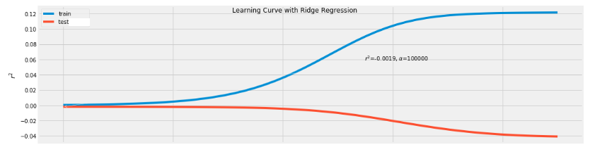

Before starting at [Metis](https://www.thisismetis.com) this past spring, I spent a fair bit of time following the day-to-day of the latest NBA season (which now, of course, is last season). You might consider this time wasted, but it did provide me the inspiration for my second project at Metis, where we were asked to build a linear regression model to address a problem of our choice. Before discussing the details of this project, let's do some story time.

For a rather substantial portion of the last NBA season, the Oklahoma City Thunder were the team breaking the "metrics," as their underlying statistics showed they were quite good relative to other teams but their winning percentage had hovered near .500 (meaning they won as much as they lost). On the contrary, the Cleveland Cavaliers, a team that was actually kind of terrible overall, finished the season with 50 wins (against 32 losses) and the second-best record in the NBA's Eastern Conference. You do not have to be the biggest NBA fan to figure out how this outcome came to be...

<iframe src='https://gfycat.com/ifr/DelightfulFaithfulAcornweevil' frameborder='0' scrolling='no' allowfullscreen width='640' height='360'></iframe>
<a href="https://gfycat.com/gifs/detail/DelightfulFaithfulAcornweevil">via Gfycat</a>

Basically, one could say the Cavaliers were overperforming their statistics (in terms of wins and losses), something that could happen if the best player in the world plays -- er, played -- for your team. On the other hand, the Thunder -- who spent most of the season [failing to integrate players who might not fit well together](https://deadspin.com/the-thunder-still-have-an-awful-lot-to-anfigure-out-1820256440) -- were underperforming their statistics.

But what exactly does it mean to "overperform" or "underperform" and what are these "statistics"? Let's first talk a little about [Pythagorean Expectation](https://en.wikipedia.org/wiki/Pythagorean_expectation) in sports.

## What exactly does Pythagoras have to do with basketball?
The idea was conceived of by [Bill James](https://en.wikipedia.org/wiki/Bill_James) (who you might know from [Moneyball](https://en.wikipedia.org/wiki/Moneyball)), who posited that a baseball team's winning percentage *should* be the following function of its runs scored and runs allowed:

For basketball, other [analysts](https://en.wikipedia.org/wiki/Dean_Oliver_(statistician)) have adapted the same formula to determine what a team's winning percentage should be:

So what does it all mean? Well, teams that should win a lot outscore their opponents by a lot (with the reverse being true for teams that lose a lot), while teams that should be mediocre will score about the same number of points as their opponents. As for the Pythagorean part, well I guess these formulae sort of look similar to the Pythagorean theorem.

As for what this has to do with overperformance and underperformance, the Pythagorean winning percentage (let's just call this Pythag hereafter) is a team's *expected* winning percentage given how many points they score/allow. If we took the difference between a team's actual winning percentage and its Pythag, then the resulting metric - let's call it *diffWP* for "differential winning percentage" -- captures some amount of overperforamnce or underperformance:

* If *diffWP* > 0, then the team overperformed
* If *diffWP* < 0, then the team underperformed

Nothing about the above is original on my part. In college basketball, the very heavily used [Ken Pomeroy ratings](https://kenpom.com/index.php?s=RankLuck) has a more rigorously calculated metric with the unfortunate and often [misinterpreted](https://www.reddit.com/r/CollegeBasketball/comments/80j6p3/tim_miles_taking_shots_at_kenpom_projections_on/) name of "Luck." In baseball, the [Baltimore Orioles](https://www.fangraphs.com/blogs/the-orioles-are-better-than-we-thought-again/) vexed analytically-minded writers and fans by beating statistical projections over the 2012-16 seasons. Performance in [close](https://www.washingtonpost.com/news/dc-sports-bog/wp/2015/03/12/dont-tell-the-maryland-terps-theyve-been-lucky-this-season/?utm_term=.9cc7b379ad05) and [late](https://fivethirtyeight.com/features/the-orioles-always-win-more-than-they-should-theres-a-reason-for-that/) game situations has been considered a factor in some teams' overperformance.

Such an observation is hardly groundbreaking. The Pythag formula says a mediocre team ought to score about as much as its opponents overall, but a team could win lots of close games while sometimes losing games by large margins, thus overperforming. A team could also win a lot of games that aren't close but often fail in the close games and underperform their Pythag. But can we develop a model that might be able to explain this possibility at all? I guess I could try... 

## The Problem: Building a linear regression model for NBA Team Overperformance/Underperformance

So back to my second project at Metis...we were asked to do some web scraping to create our own datasets and then build a linear regression model using said data. For my model, I used *diffWP* -- the differential winning percentage defined above -- as a response variable and a subset of NBA team regular-season statistics (which I'll refer to as metrics hereafter) as features. These features include metrics characterizing all game situations, metrics isolated to performance in "clutch" situations, and some team characteristics (such as the average age of a team's players).

Now I happened to have a hunch (see the tl;dr preceding this section) which I wanted to see if the data could support, so my process to carry the project out was as follows:

1. Build a linear regression model for *diffWP* using only features for all game situations as something of a baseline.
2. Add features for clutch situations to the set of features and build a new regression model, evaluate what changes.

Models were evaluated using the R2 statistic. For the ultimate best-performing model, I then examined the feature coefficients to help explain what team characterstics and performance metrics are important to overperformance/underperformance (as measured by *diffWP*). At this point, the modeling effort is exploratory in nature, particularly in developing proficiency in scraping and preparing data, then using statsmodels and scikit-learn to build and refine a model. While the goal was to develop a predictive model, the emphais of this project is on interpretation and not prediction.

## The Data

I used [Beautiful Soup](https://www.crummy.com/software/BeautifulSoup/), a great tool for parsing HTML code, to scrape [Basketball-Reference](https://www.basketball-reference.com)'s pages and pages of tabular HTML data. I also scraped [NBA.com](https://stats.nba.com), using [Selenium](http://selenium-python.readthedocs.io) in combination with BeautifulSoup, to mimic a browser clicking through a series of pages and scraping HTML tables on each page.  

From both sites, I collected data on all teams starting from 2001-02 through the 2017-18 season. The Basketball-Reference data came from its "Season Summary" pages ([example](https://www.basketball-reference.com/leagues/NBA_2018.html)), namely the "Miscellaneous Stats" tables on these pages:

The NBA.com data came from its pages of data collected over "clutch" situations ([example](https://stats.nba.com/teams/clutch-four-factors/?sort=W_PCT&dir=-1)), which are defined as occurring within the last five minutes of regulation or overtime with neither team leading by more than five points:

To get an idea about some of the metrics collected in these tables, you can find descriptive glossaries [here](https://www.basketball-reference.com/about/glossary.html) and [here](https://stats.nba.com/help/glossary/). I chose to scrape the above data out of all the data available at Basketball-Reference and NBA.com to obtain the [Four Factors](https://www.nbastuffer.com/analytics101/four-factors/) for all teams in all game and clutch situations, which some have found to correlate well with offensive/defensive success in basketball. I also wanted to use a table which made it as convenient as possible to calculate *diffWP* for each team in each season -- note the columns for W (wins), L (losses), PW (Pythagorean wins) and PL (Pythag losses) in the "Miscellaneous Stats" table from Basketball-Reference.

There were initially 507 team seasons in the collected data, which was reduced to 391 after eliminating team seasons with an actual winning percentage under 0.366 (to accomodate the 2011-12 lockout shortened season, the equivalent of winning 30 games in a standard 82-game season), to eliminate [tanking](https://www.sbnation.com/2018/4/6/17205654/nba-tanking-teams-worst-record-standings-draft-picks) teams who are intentionally losing games. After dropping some columns from these tables (e.g., Attendance, Arena, W, L) which were either:

* Essentially inputs or closely related to my response variable *diffWP* (e.g., wins, losses, margin of victory-related features)
* Not terribly relevant to the response variable, or
* Better captured by another metric (Clutch Games Played vs Clutch Minutes Played)

There were 391 team seasons with 14 all game situation features and 9 clutch situation features.

## Model 1: All Game Situation Features Only

Before doing any model building, let's first take a look at the distribution of *diffWP*, which appears to be bimodal and a little bit skewed to the left, but not truly worrisome for any concerns about adequacy for a linear regression model (though a normally distributed response variable is not a model assumption).

The two highest overperforming teams (to the far right in the histogram) are:

* **2015-16 Golden State Warriors**, one of the greatest teams in NBA history
* **2005-06 Utah Jazz**, a .500 team that nevertheless was one of the [best clutch teams](https://stats.nba.com/teams/clutch-four-factors/?sort=W_PCT&dir=-1&Season=2005-06&SeasonType=Regular%20Season) for that season

Meanwhile, the highest underperforming team (to the far left in the histogram is:

* **2005-06 Philadelphia 76ers**, a playoff team that was also one of the [worst clutch teams](https://stats.nba.com/teams/clutch-four-factors/?sort=W_PCT&dir=-1&Season=2011-12&SeasonType=Regular%20Season) for that season

Taking the slice of the pairplot of *diffWP* and the features is not all that encouraging:

None of these features appear to have much of a linear relationship with *diffWP* -- but let's perhaps validate some of those concerns by beginning to build a model. The general process -- "pipeline" if you will -- I'll be using is as follows:

* Split the data into a training and holdout set, on the season level. In this case, I split the data in the simplest way possible, leaving data from the most recent season (2017-18) out as a holdout with all previous seasons (2001-02 through 2016-17) as a training set. 
* Fit a quasi-baseline model to the larger training set, and evaluate on the holdout set -- using all features to get a sense of overfitting/underfitting
* Further split and standardize (using StandardScaler) the training set into different (sub)training sets and test sets to perform something resembling cross-validation in tandem with as needed feature selection/regularization using SelectKBest and/or Ridge Regression. Five splits are made in the training data on the season level; the (sub)training set includes all data up through season x, while the test set will have everything after that up through the 2016-17 season (where x = 2011-2012, 2012-13, 2013-14, 2014-15, 2015-16). Evaluate models based on average R2 on test sets.
* Fit a model returned from the above on the full training data, evaluate on the holdout set, and interpret the model.

My initial "baseline" model (including all features) resulted in a training R2 of 0.109 and a holdout R2 of 0.138, which might indicate some amount of underfitting. I still went ahead and tried out SelectKBest and Ridge Regression, and the results were as expected (example learning curve of Ridge Regression below):

Hoping to improve model performance, I moved on to the clutch performance features scraped for each team season from NBA.com, adding them to the set of features.

## Model 2: Adding Clutch Performance Features

Adding the clutch performance features was not without insignificant annoyance, in the very slight ways in which NBA.com and Basketball-Reference differ in displaying team names in their data, thus requiring some small effort to merge data collected from the two sites:

* Basketball-Reference uses "Los Angeles Clippers," while NBA.com uses "LA Clippers"
* Basketball-Reference uses "New Orleans/Oklahoma City Hornets" while NBA.com uses "New Orleans Hornets" to refer to the now New Orleans Pelicans' brief period representing two cities in the wake of Hurricane Katrina.

Having taken care of these issues, a look at a slice of the pairplot for the clutch performance features is at least slightly more encouraging than that with the all game situations features:

I ran an initial model with the entirety of my new feature set. For this model, the training R2 was 0.415, with a holdout R2 of 0.305, indicating some level of overfitting is at work here. Below are the results from SelectKBest and Ridge Regression on the combined all game situations and clutch data:

| | Avg. Training R2 | Avg. Test R2|
| ----------|:---------:|:----------:|
| SelectKBest (K=7) | 0.242 | 0.208 |
| Ridge | 0.421 | 0.335 |

From the above, I chose the model returned from Ridge Regression, even though I've not improved model performance much. When this model is fit back on the entire training data and evaluated on the holdout data, we get an R2 = 0.300. Let's see how this model explains overperformance and underperformance of NBA teams using *diffWP*, the difference between actual and expected (Pythag) winning percentage.

## Interpreting the "Final" Model: The Clutch Gene?

The chosen model has the following seven features with corresponding coefficient values as displayed below: 

We see a mix of clutch and all situations performance metrics involved here. Given the positive coeffiicents for **ClutcheFG** and **ClutchFTARate**, teams that overperform tend to shoot efficiently and do a good job of getting to the free throw line (relative to the number of shots they take) in clutch situations. The negative coefficients associated with **ClutchOppeFG%** and **ClutchOppFTARate** seem to indicate that in cluthc situations, overperforming teams also do a good job of preventing their opponents from efficiently making shots and getting to the free throw line (relative to the number of shots they take) in clutch situations. That **Age** has a positive coefficient might indicate that older, more experienced teams also have a tendency to overperform rather than underperform.

The largest positive coefficient in the model belongs to **DeFG%**, which along with the positive coefficient for **DFT/FGA**, suggests that teams that overperform tend to be very good in general at keeping their opponents from making shots efficiently and getting to the free throw line. One interpretation might be that teams that tend to overperform will also tend to keep games close enough to be winnable -- and then potentially prevail in clutch situations.

That there are negative coefficients associated with both **DTOV%** and **DRB%** (overall defensive turnover percentage and defensive rebounding percentage) might speak to the why these teams may struggle enough defensively so that they have to overachieve. These teams may be very effective in defending their opponents shots and not fouling them but also may be quite poor in keeping opponents from retaining possessions once they force missed shots or keep them from shooting free throws.

## Discussion: Including Limitations, Caveats, and Inklings of Next Steps

None of the takeaways from the model returned are exactly mindblowing -- in fact, most are dangerously close to proposing a [make shots/miss shots](https://twitter.com/oneshiningpod/status/1023911471636508673) strategy adapted to close and late game situations. However, there is some potential utility here for people in charge of running basketball teams in terms of player acquisition and deployment. [Veteran presence](https://www.google.com/search?client=safari&rls=en&q=veteran+presence&ie=UTF-8&oe=UTF-8) may be a top and oft-mocked sports trope but [adding](https://en.wikipedia.org/wiki/Shawn_Marion) [experienced](https://en.wikipedia.org/wiki/Ray_Allen) [players](https://en.wikipedia.org/wiki/Richard_Jefferson) [doesn't hurt](https://en.wikipedia.org/wiki/Andre_Iguodala). These players are also those who might contribute to some clutch performance metrics such as **ClutchFTARate** and **ClutchOppFTARate**, where experience might help in defending without fouling or drawing fouls to get to the free throw line. Further, the model provides some simple rules for focusing on defensive-minded players and selecting a player mix that is especially good at shooting, getting to the free throw line, and defending shots without fouling in close and late situations.

However, not considering player mix, or individual player performances is a major limitation of the model. NBA.com has a plethora of [lineup-level data](https://stats.nba.com/lineups/advanced/), when combined with [individual player data](https://www.basketball-reference.com/leagues/NBA_2018_advanced.html) and [play-by-play data](https://www.nbastuffer.com/analytics101/playbyplay-data/), can be used to derive more interesting and perhaps explanatory features describing how often the best players on each team are playing in clutch situations. Even more team-level features would also help -- data on the [types of shots](https://stats.nba.com/teams/scoring/?sort=W&dir=-1) teams take and make may give a better picture of the true shooting efficiency of a team. 

Finally, it should not be lost that the clutch and all game situation versions of different features (e.g., **eFG%** and **clutcheFG%**), as well as other model features might present collinearity issues. While regularization techniques such as Ridge can alleviate these issues, future modeling will require additional analysis in identifying and making decisions with potentially collinear features. Another potential "solution" might involve replacing inclusion of both clutch and all game situation version of different performance metrics and using just the ratio of the clutch versions to the all game situations versions.

Hopefully, I at least managed to start scrubbing away some of the question marks concerning overperforming and underperforming NBA (and professional sports) teams.

