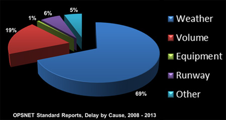

In the not-so-distant past I spent a fair amount of time thinking about congestion in the National Airspace System (NAS) -- although not from a data science perspective -- which meant congestion at airports and which at least has something to do with flight delays. Back when I was deep in this stuff, the primary causes of flight delays were said to be "Weather" and "Volume," or too much demand, meaning too many scheduled departures and arrivals ([source](https://www.faa.gov/nextgen/programs/weather/faq/)): 

  

The New York City "metroplex" -- primarily John F. Kennedy International Airport (JFK), LaGuardia Airport (LGA), and Newark Liberty International Airport (EWR) -- is a particular [mess](https://www.businessinsider.com/heres-why-new-york-city-air-traffic-is-so-congested-2015-7) for air travelers with delays resulting from weather as well as physical and regulatory capacity limitations (amongst other factors).

The Federal Aviaition Administration (FAA) considers a flight delayed if it arrives at the destination gate at least 15 minutes later than its scheduled arrival time. Airlines themselves report the [causes](https://www.bts.gov/explore-topics-and-geography/topics/airline-time-performance-and-causes-flight-delays#q2) of indivudal delayed flights with at least a domestic origin or destination to the Bureau of Transport Statistics (BTS), with "Weather" and "NAS" being the most analogous reporting categories to "Weather" and "Volume." The BTS collects all these reports, in addition to those on non-delayed flights, on a monthly basis in its [Airline On-Time Performance Data](https://www.transtats.bts.gov/Tables.asp?DB_ID=120&DB_Name=Airline%20On-Time%20Performance%20Data&DB_Short_Name=On-Time).

With all of the above in mind, and knowing how miserable the air travel experience can often be, for my third Metis project I sought to build a classification model to examine which flight schedule and weather features are predictive of whether individual flights originating from one of the three primary NYC metroplex airports (EWR, JFK, LGA) are delayed or not. While the end goal of building such a model is to actually predict whether a given NYC metroplex-originating flight will be delayed, my main focus was on first understanding why flights from the NYC region might be delayed.

## The Data

I first obtained the aforementioned BTS Airline On-Time Performance (AOTP) data, which are available for each month in .zip files containing a .csv file with a row corresponding to each individual reported flight for that month associated with the following relevant data fields:

* Origin and destination airport (as 3-letter airport codes)
* Unique carrier (airline)
* Year, quarter, month, date, and day of the week
* Scheduled and actual departure and arrival times (given in local time)
* The hourly block (in local time) for departure and arrival
* Total elapsed time of the flight including air time and ground time
* Total time delayed (departure and arrival) and the breakdown of these times by type of delay
* Indicators for whether there was an departure/arrival delay, cancellation or diversion for the flight

While these files can be manually downloaded, the process requires repetitive clicking and navigation amongst several pages, so I created a Selenium script to automate the process of obtaining and then unzipping these files for later use.

For weather data, I used NOAA's [Global Historical Climate Network Daily (GHCND)](https://www.ncdc.noaa.gov/ghcn-daily-description) dataset, which provides daily weather observations collected from different global weather stations on a yearly basis. You can manually download data for each year [here](https://www1.ncdc.noaa.gov/pub/data/ghcn/daily/by_year/), along with a list of [weather stations](https://www1.ncdc.noaa.gov/pub/data/ghcn/daily/ghcnd-stations.txt) and a nice [reference](https://www1.ncdc.noaa.gov/pub/data/ghcn/daily/readme.txt) for all the weather observations, a subset of which are:

* Average daily tempreature
* Average daily wind speed
* Total precipitation

Finally, I used additional data from the BTS' [Airline Origin and Destination Survey](https://www.transtats.bts.gov/Tables.asp?DB_ID=125&DB_Name=Airline%20Origin%20and%20Destination%20Survey%20%28DB1B%29&DB_Short_Name=Origin%20and%20Destination%20Survey) -- specifically the DB1B Coupon data -- which contain records for 10% of passenger itineraries on US flights on a quarterly basis. These data are contained in .csv format within .zip files and include origin, destination, fare, fare class for each segment flown for a given reported itinerary. This data may be useful for calculating a rough estimate of the types of passengers typically flying on a given origin-destination pair. As with the AOTP data, I created a Selenium script to bulk download and unzip the DB1B Coupon data.

## Putting the Data Together

I collected data for a number of years up through 2017, but ultimately settled on evaluating flights from 2015 through 2017. The data from 2015-16 was my training data, while I treated the 2017 data as a holdout test set. It turns out that the AOTP data is extremely large -- keeping everything from the three years included consists of slightly more than 17 million observations. After filtering only for flights whose origin is either EWR, JFK or LGA, there are still ~930,000 observations.

Flights that were either cancelled or diverted were removed, as they are reported and treated as fundamentally different events. I further chose to include flights to a subset of destinations (within the Lower 48) and airlines that would account for 95% of this data, ultimately including flights to 57 destination airports operated by 7 airlines (Delta, United, JetBlue, American, Southwest, Virgin, ExpressJet). Evaluation was further restricted to flights with a scheduled departure time between 6 AM and 9 PM local time and a scheduled arrival time between 8 AM and Midnight local time. The end result of all these operations left me with ~730K observations.

Bringing in the weather data was not entirely straightforward. For one thing, after reading this data in, we can see that its format requires some reshaping:

  

The first three rows above are each individual weather observations from the same location and same date, and ideally this data would be structured so each row was all weather observations collected from a single location on a single date. You might also notice the "TMAX" (or maximum temperature) is a bit high for one particular weather station at this date, the units recorded here for each daily weather observation is on a bit of an odd scale (temperature, for example, is in tenths of a &#8451;).

Furthermore, the first column above contains the IDs for different weather stations. These are quite clearly not the airport identifiers from the AOTP data. In order to match up the weather data with the AOTP data, I need to:

1. Collect latitude/longitude pairs of each origin/destination airport included using Ryan Burnette's [Airports API](https://github.com/ryanburnette/airports-api)
2. Collect latitude/longitude pairs of each station from NOAA's reference list
3. Use [geopy](https://geopy.readthedocs.io/en/stable/) to find the nearest weather station to each airport by Vincenty distance

After all reshaping of the weather data, matching weather stations to airports, and joining weather to each flight in the AOTP data for both origin and destination airport, there are some missing data accounting for ~5% of the data which I ultimately removed. The final data has ~ 703K observations.

## Some Feature Engineering

The data so far hasn't captured travel volume to/from either the individual origin and destination airports, or anything about flights (the origin-destination pairs) themselves beyond their exact schedule and travel time. I used the DB1B Coupon data to calculate the proportion of business class passengers (which I called the Business Passenger Ratio) on each possible origin-destination pair included in the data over each quarter, reasoning that flights with higher levels of business travelers might find themselves delayed more frequently. Unfortunately, the DB1B Coupon is neither on the same timescale as the rest of my data nor does it provide any specific temporal data for when the different passenger itineraries happened, so the estimates calculated this way are crude at best.

Additionally, while the different time of year and time of day act as proxies for volume to/from each airport to an extent, nothing described as of yet properly characterizes why volume matters so much -- that airports can only accomodate a certain amount of departures and arrivals per unit time. Below is a capacity profile for LGA under normal conditions ([source](https://www.faa.gov/airports/planning_capacity/profiles/media/LGA-Airport-Capacity-Profile-2014.pdf)). The solid line indicates the nominal hourly operating capacity at LGA, while the different points describe the frequency at which LGA was operating at some combination of hourly arrivals and hourly departures. We can see that in normal operating conditions, LGA is frequently very near its hourly capacity in terms of actual arrivals and departures.

  

I came up with a quick and dirty method for creating a feature that might be able to capture this very issue:

1. Using the full data, sum up the total scheduled arrivals and departures (hourly volume) to each airport.
2. For each year and airport, find the maximum hourly volume.
3. For each year, airport and hour, divide the hourly volume by the maximum hourly volume for that airport.

Then for each year-airport-hour, the resulting value is an estimate of the percentage of hourly maximum capacity "used" by that airport for that hour. I called this feature Origin Performance and Destination Performance depending on which airport it is for a given flight.

## Model Features and Response

I ended up with the following features for modeling:

#### Flight Schedule Features
* Air Time (as a proxy for travel time)
* Month
* Day of Week
* Scheduled Departure Hour
* Scheduled Arrival Hour
* Origin Airport
* Airline
* Business Passenger Ratio
* Origin/Destination Performance

#### Weather Features
* Average Daily Temperature (at Origin and Destination)
* Average Daily Wind Speed (at Origin and Destination)
* Total Daily Precipitation (at Origin and Destination)

As for not including destination airports, I was concerned with including too many features (as a new dummy feature would have to be created for [all but one](http://www.algosome.com/articles/dummy-variable-trap-regression.html) destination airport) and my empahsis for the project is on flights originating from the NYC area and what travel bottlenecks the specific airports in that region present. My hope is that Weather data and some feature engineering might capture some of the variation between destinations (and more for the origins as well) without blowing up the feature space.

The response variable, if you've been following, is a binary variable indicating a flight is delayed (=1, the positive class) or not delayed (=0, the negative class).

## Model Selection

Since my initial emphasis was on interpretation -- why the flights are delayed -- I looked only at Logistic Regression and Random Forests, which I further broke down according to which features I included. The candidate models I evaluated were:

* **LRFlight**, Logistic Regression with Flight Schedule features only
* **LRWX**, Logistic Regression with Weather features only
* **LRFlightWX**, Logistic Regression with all features
* **RFFlight**, Random Forest with Flight Schedule features only
* **RFWX**, Random Forest with Weather features only
* **RFFlightWX**, Random Forest with all features

These are "baseline" models which are fit without any exhaustive parameter tuning. Since the classes are not balanced (only 21.8% of the flights in the data are delayed), I set the parameter `class_weight = balanced` for Logistic Regression and Random Forests models. Otherwise, for Logistic Regression all scikit-learn default paramters are used, while I set `n_estimators = 100` and `max_depth = 3` with the remaining parameters as defaults for Random Forests. While not a requirement for Random Forests (but needed for Logistic Regression due to the regularization penalty), all numerical features (all weather features, Air Time, Origin and Destination Performance, and Business Passenger Ratio) are scaled using StandardScaler.

I evaluated each candidate model for **Recall** across several train/test splits in the training set of flights originating from NYC airports in 2015-16:
* Train: All of 2015, Test: All of 2016
* Train: All of 2015 + Q1 2016, Test: Q2-Q4 2016
* Train: All of 2015 + Q1-Q2 2016, Test: Q3-Q4 2016
* Train: All of 2015 + Q1-Q3 2016, Test: Q4 2016

For this particular application, Recall is the percentage of actual delayed flights which the given model correctly identifies as delayed. Recall is selected in part due to class imbalance and more so for the high costs associated with false positives (delayed flights classified as non-delayed flights).

From the below set of boxplots (even if it might seem a bit silly to use boxplots for model comparison with just four samples each), **RFFlight**, the Random Forest model with only Flight Schedule features, appears to perform best with respect to Recall.

  

Using this model, I performed some paramter tuning on `n_estimators` and `max_depth`, with an optimized version of **RFFlight** with `n_estimators = 200` and `max_depth = 3`. This model resulted in the final confusion matrix and a Recall of 0.7398 after fitting on the entire training data and evaluating on the holdout data for all 2017 flights. We see that by prioritizing Recall, Precision has suffered as a consequence -- note the high number of false positives (non-delayed flights misclassified as delayed).

  

Presented below are the 10 most important features below, the features whose values contribute the most to differentiating between delayed and non-delayed flights. We see that these features primarly include early morning and evening scheduled departure times and late morning and late night arrival times. This seems sensible given that these time periods will generally have lots of volume being associated with travel for business.

  

Notably **OrigPerf**, or Origin Performance, the percentage of capacity of scheduled hourly volume at origin airports, is the second most important feature. This latter point indicate that scheduled volume at the three NYC airports, especially during times of the day when many passengers are flying (aligned with business hours) can impact the incidence of large arrival delays.

## Takeaways, Limitations, Caveats, and other Parting Shots

First, there are some limitations to these results as well as the overall model building and evaluation. Many of the flight schedule features (e.g., time of day, day of week, time of year) are categoricals converted into dummy variables. [Random forests are not necessarily ideal](https://roamanalytics.com/2016/10/28/are-categorical-variables-getting-lost-in-your-random-forests/) to use with many variables of this type and introduce the possibility that evaluation of the models over certain validation sets do not include a large enough number of observations (if any) for a particular level of a categorical variable. Also, the way that the **OrigPerf** and **DestPerf** features (describing the flight volume and capacity at origin and destination airports, respectively) are constructed may pose some [data leakage](https://blog.myyellowroad.com/beware-of-data-leakage-f6c307009ad9) issues in evaluating models. However, these issues could be diminished by using maximum hourly flight volumes over the smallest time period by which the train/test splits are made (e.g., over a quarter instead of the full year).

The end model and its feature importances suggest that overscheduling at the origin airports, particularly at hours corresponding to the beginning and end of the business day, figure substantially in whether individual flights are delayed or not delayed. From the selection of this model, weather may not appear to play much of a role, but it's quite possible other weather features not considered might change the results (e.g., snow, maximum wind speed).

The model selection process may also play a role -- while I've correctly considered the cost of misclassifying the positive class (delayed flights), considering other criteria for evaluation which account for real costs of true delay and misclassified delay (as well as other costs--say the unnecessary planning for misclassified non-delayed flights) might prove more meaningful. Additionally, while as shown above the performance of the **RFFlight** model appears to be clearly better than other models, my workflow would be improved by considering all parametrically-tuned models along with these "baselines" in model selection, instead of just selecting **RFFlight** and optimizing parameters for that model.

Finally, there are some important features involved in this problem which I have not yet considered at all. There are major sequential and temporal aspects to characterizing flight delays, such as seasonality and simply following flight tail numbers (i.e., an aircraft for an already delayed flight is more likely to be delayed on its next flight(s)). These should be the most compelling next steps for this effort, in addition to refining how to best capture volume from an airport capacity usage standpoint -- even if the model so far performs and captures the issues with scheduling volume adequately enough.
